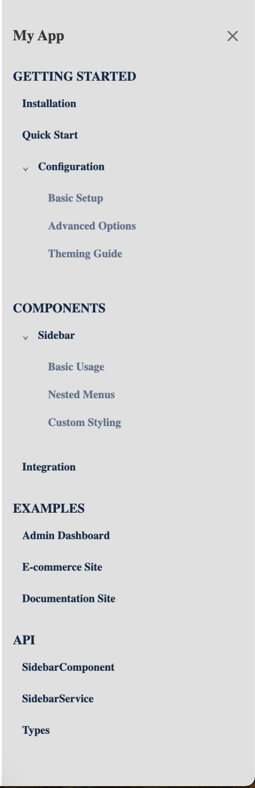

# 🌟 ngx-smart-sidebar

A customizable, collapsible, responsive, feature-rich sidebar component for Angular apps.


## ✨ Features

- 🌈 Fully customizable styling with background/hover colors
- 📏 Multiple size options (small, medium, large)
- 🔀 Flexible positioning (left or right)
- 📊 Multi-level nested navigation support
- 📱 Responsive design with collapsible functionality
- 🔄 Angular Router integration
- 👆 Click-outside closing capability
- 💾 State persistence between sessions

## 🚀 Installation

```bash
npm i @ngx-smart/ngx-smart-sidebar --save
```

## ⚙️ Basic Implementation

1. Import the SidebarComponent in your Angular Component / Module:
2. Define your sidebar items
3. Use the sidebar component in your template

```tsx
import { Component } from "@angular/core";
import { SidebarComponent, SidebarSection } from "@ngx-smart/ngx-smart-sidebar";

@Component({
  selector: "app-root",
  standalone: true,
  imports: [SidebarComponent],
  template: `
    <lib-sidebar [items]="sidebarItems" [title]="'Navigation'" [activeItemPath]="'/dashboard'" [sidebarId]="'main-sidebar'"> </lib-sidebar>

    <div class="content">
      <!-- Your page content here -->
    </div>
  `,
})
export class AppComponent {
  sidebarItems: SidebarSection[] = [
    {
      header: "Main",
      labels: [
        { label: "Dashboard", path: "/dashboard" },
        { label: "Analytics", path: "/analytics" },
        {
          label: "User Management",
          children: [
            { label: "User List", path: "/users" },
            { label: "Add User", path: "/users/add" },
          ],
        },
      ],
    },
    {
      header: "Settings",
      labels: [
        { label: "Profile", path: "/profile" },
        { label: "Preferences", path: "/settings" },
      ],
    },
  ];
}
```

## 🎨 Custom Styling & Content

```html
<lib-sidebar [position]="'left'" [width]="'medium'" [title]="'My App'" [items]="sidebarItems" [activeItemPath]="activePath" [sidebarId]="'main-sidebar'" [collapsible]="true" [sidebarBackgroundColor]="'#f5f5f5'" [backgroundHighlightColor]="'#e0f7fa'">
  <!-- Custom header content -->
  <div sidebarHeaderContent>
    
  </div>

  <!-- Custom footer content -->
  <div sidebarFooterContent>
    <p>© 2025 My App</p>
  </div>
</lib-sidebar>
```

## 🛠️ Configuration Options

### Input Properties

| Input                      | Type             | Default     | Description                                                                                    |
| -------------------------- | ---------------- | ----------- | ---------------------------------------------------------------------------------------------- |
| `position`                 | SidebarPosition  | `'left'`    | Position of the sidebar. Options are `'left'` or `'right'`.                                    |
| `width`                    | SidebarWidth     | `'medium'`  | Width of the sidebar. Options are `'small'` (150px), `'medium'` (250px), or `'large'` (300px). |
| `title`                    | string           | `''`        | Title displayed at the top of the sidebar.                                                     |
| `backgroundHighlightColor` | string           | `'#f5f7fa'` | Background color for highlighting when hovering over items.                                    |
| `items`                    | SidebarSection[] | `[]`        | Array of sidebar section objects defining the navigation structure.                            |
| `activeItemPath`           | string           | `''`        | Path of the currently active item, should match the router path.                               |
| `sidebarId`                | string           | `''`        | Unique identifier for the sidebar, useful when using multiple sidebars.                        |
| `collapsible`              | boolean          | `true`      | Whether the sidebar can be collapsed.                                                          |
| `hideSidebarOnPathChange`  | boolean          | `false`     | Whether to automatically collapse the sidebar when the route changes.                          |
| `closeOnClickOutside`      | boolean          | `false`     | Whether to close the sidebar when clicking outside of it.                                      |
| `sidebarBackgroundColor`   | string           | `'#ffffff'` | Background color of the sidebar.                                                               |

### Types

```tsx
export type SidebarPosition = "left" | "right";
export type SidebarWidth = "small" | "medium" | "large";

export interface SidebarLabel {
  label: string;
  path?: string;
  children?: SidebarLabel[];
  isExpanded?: boolean;
}

export interface SidebarSection {
  header: string;
  labels: SidebarLabel[];
}
```

### 📸 Visual Examples

#### Default Sidebar


#### Custom Hover Background


#### Custom Sidebar Background



## Custom Header and Footer Content Projection

The sidebar provides two content projection slots:

- sidebarHeaderContent: Custom content for sidebar header area
- sidebarFooterContent: Custom content for sidebar footer area

You can add custom content to the header and footer of the sidebar:

```html
<lib-sidebar [items]="sidebarItems">
  <div sidebarHeaderContent>
    
  </div>

  <div sidebarFooterContent>
    <p>© 2025 My App</p>
  </div>
</lib-sidebar>
```

## 🤝 Contributing

Contributions are welcome! Please feel free to submit a Pull Request.

## 📄 License

This project is licensed under the MIT License - see the LICENSE file for details.
